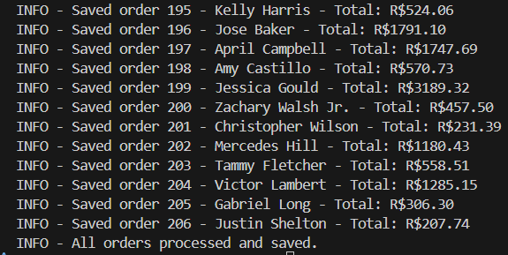
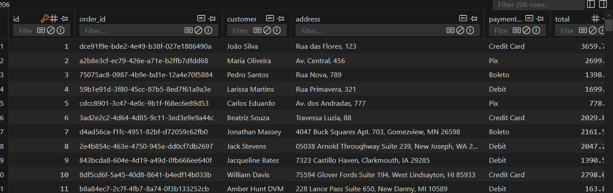

# 🛠️ rpa-process-buddy

Automação de processamento de pedidos para uma loja online fictícia.

Este projeto foi desenvolvido com foco em boas práticas de desenvolvimento, automação, manipulação de dados e escalabilidade.

---

## 🚀 O que o projeto faz

- Recebe pedidos por dois modos de entrada:
  - **faker**: gera pedidos falsos automaticamente (para termos uma massa de dados para ser exibida posteriomente caso necessario)
  - **json**: simula consumo de API, lendo arquivos com pedidos
- Processa cada pedido, calcula o total e aplica status
- Armazena os pedidos em um banco SQLite
- Evita duplicações com base em `order_id`
- Gera um relatório CSV com todos os pedidos processados

---

## ⚙️ Como executar

### 1. Clone o repositório e entre na pasta:

```bash
git clone https://github.com/seu-usuario/process-buddy.git
cd process-buddy
```

### 2. Crie e ative o ambiente virtual:

```bash
python -m venv .venv
source .venv/bin/activate      # Linux/macOS
.venv\Scripts\activate         # Windows
```

### 3. Instale as dependências:

```bash
pip install -r requirements.txt
```

### 4. Configure o ambiente:

Edite o arquivo `env.json` com base no `sample_env.json`:

```json
{
  "INPUT_MODE": "faker",
  "FAKER_QUANTITY": 100,
  "JSON_INPUT_PATH": "src/incoming_orders/",
  "GENERATE_REPORT": true,
  "REPORT_OUTPUT_PATH": "report.csv"
}
```

### 5. Execute o projeto:

```bash
python -m src.main
```

---

## 🧪 Modos de entrada

### ✅ Modo `faker`
- Gera dados fictícios de pedidos
- Ideal para testes de volume

### ✅ Modo `json`
- Lê arquivos `.json` simulando pedidos reais (como resposta de uma API)
- Cada arquivo pode conter **uma lista de pedidos**

---

## 🗂️ Estrutura de pastas

```
project/
├── data/                  ← banco SQLite e relatório CSV
├── src/
│   ├── core/              ← lógica de negócio e utilitários
│   ├── db/                ← modelos e conexão com o banco
│   └── main.py            ← ponto de entrada principal
├── env.json
├── sample_env.json        ← arquivo de exemplo variaveis do projeto
└── requirements.txt
```

---

# 📸 Registro de inserção no banco via log




# 📸 Registro dos dados no DB:



---

## 🧠 Tecnologias utilizadas

- Python 3.11+
- SQLite + SQLAlchemy
- Faker
- Logging
- Tipagem e boas práticas de projeto

---

## 📌 Observações finais

Este projeto simula um cenário real de automação e manipulação de dados para um fluxo de pedidos. Apesar de ser um ambiente fictício, a estrutura e lógica seguem padrões aplicáveis em projetos reais, como por exemplo a estruturada realizada do processamento via json, simula uma interação que possivelmente seria realidade via API's.

---
